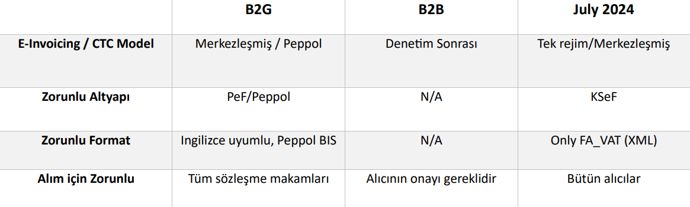

## Intro

Bu dökümantasyon,

e-fatura Entegrasyon Projesi [`PolyLocale`](#intro) çerçevisinde, Polonya e-fatura düzenlemelerine uyum sağlama amacı taşıyan stratejik bir inisiyatiftir. Bu proje, iki temel sistemin entegrasyonunu içerir: [PEF](https://efaktura.gov.pl/uslugi-pef/)    (e-faturalama Platformu) ve [KSeF](https://ksef-test.mf.gov.pl/) (Ulusal e-Fatura Sistemi). 

> PEF; kar gütmeyen, ihale makamları ve ihale yüklenicileri arasında yapılandırılmış e-faturaların ve diğer belgelerin alınması ve gönderilmesi için merkezi bir platformdur.

**Bu projenin temel amacı** EDM bilişimin firmasının, hali hazırda Türkiye'de yürüttüğü e-fatura alanındaki entegratör operasyonlarının Polonya lokalizasyonunu ve halka açık bir fatura altyapısı arasındaki kritik bağlantıyı sağlamaktır. 

**Polylocale kapsamında, aşamalı 5 hedefe odaklanılır:**

- [Hukuki ve Düzenleyici Uyumluluk](#yasal-ve-düzenleyici-uyumluluk)
- [Sistem Mimarisi](#sistem-mimarisi)
- [PEF Sistemi Entegrasyonu](#pef-dokümantasyonu)
- [KSeF Sistemi Entegrasyonu](#ksef-dokümantasyonu)
- [Veri Eşlemesi ve Dönüşüm](#veri-haritalama-ve-dönüştürme)


## Projeye Genel Bakış

Büyük şirketler, güncel olarak sanal ortamda faturalandırma sistemlerinin tamamının değiştirilecek olması dolayısıyla; **1 Temmuz 2024** tarihinde temelli [KSeF VAT(KDV)](https://www.podatki.gov.pl/e-deklaracje/dokumentacja-it/struktury-dokumentow-xml/#ksef) entegrasyonlarının hazırlık aşamalarına başlamış durumdalar. [KSeF VAT(KDV)](https://www.podatki.gov.pl/e-deklaracje/dokumentacja-it/struktury-dokumentow-xml/#ksef) sistemi zaten bir önceki hazırlamış olduğumuz `KSeF e-beyanname` programı ile yapı bakımından çok benzer yapıya sahip olduğunu belirtmek isterim. Polonya'da Düzenlenmiş ve değiştirilmesi **1 Temmuz 2024** tarihinde planlanan  **temel ve ticari fatura senaryolarına dayanan e-fatura Sistem özellikleri tablosu** aşağıdaki gibidir.



Yukarıda da görüldüğü gibi şu an hükümetin **PEF** ve **Peppol** platformları aracılığıyla [manuel](https://www.brokerinfinite.efaktura.gov.pl) veya [otomatik](#intro) olarak sanal ortamda fatura kesmek mümkündür. 

> **Manuel** fatura kesimlerinde, istemci bir kullanıcıdan; kuruluşun adı, NIP(Vergi Kimlik Numarası), REGON (sadece Faktör için), e-mail ve Güvenilir bir profille tanımlama istenir.

> **Otomatik** fatura kesimlerinde, API kullanılarak faturanın `UUID`'si ile yani unique ID'si ile fatura kesmek de mümkün. İlerleyen bölümlerde endpoint bölümü hakkında bilgiler de mevcuttur.

?> Faturalandırmalarda güncel olarak *elektronik imza zorunluluğu yoktur*.

?> Fatura saklama işlemleri, [entegratörlerin bulutlarında]() 5 yıl, [OSS](https://www.pagero.com/blog/oss-ioss) (One-Stop Shop) şeması altında 10, [KSeF](https://ksef-test.mf.gov.pl/) altında ise 10 yıldır.  

> [OSS](https://www.pagero.com/blog/oss-ioss) nedir? Tek Noktadan Hizmet (OSS) programı, tüm AB Üye Devletlerindeki satışlarda KDV'nin tek bir vergi dairesine ödenmesinin olanağını sağlayan bir programdır.

<br>

<h3>Polonyadaki ERP çözümlerinde uzmanlaşmış entegratörler</h3>

[ERP yazılım/danışmanlık hizmetleri veren 43 firmayı görüntülemek için buraya tıklayınız.](https://clutch.co/pl/it-services/erp)
[Alternatif link](https://www.goodfirms.co/implementation-services/erp-consulting/poland)	
1. [Saergin](https://seargin.com/), ERP danışmanlığı ve uygulama hizmetleri sunan bir yazılım geliştirme şirketi. Öncesinde BNP PARIBAS, Orange, T-Mobile, BOSCH, Nestle gibi büyük firmalar ile referansları da vardır.
2. [Arche Softronix]("https://archesoftronix.com/enterprise-resource-planning/"), Polonya'da da bir ayağı olan ve yazılım geliştirme hizmetleri sunan, oracle; atos, generali gibi referansları da bünyesinde bulunduran bir ERP firmasıdır.  
3. [asseco](https://assecobs.pl/erp/), kurumsal yönetim için ERP sistemleri tedarik eden ve uygulayan bir ERPdir. 
4. [itransition](https://www.itransition.com/erp), global ERP yazılım/danışmanlık firmaları arasındak liderlerinden.
5. [evergopartners](https://evergopartners.com/), allegro ile işbirliği yapmış olan evergopartners, Polonyadaki ERP yazılım/danışmanlık firmaları arasındaki lider 
6. [comarch](https://www.comarch.com/erp/), Polonya'daki birçok işletme tarafından kullanılan kapsamlı bir muhasebe ve ERP yazılım firmasıdır. Finansal yönetim, raporlama ve Polonya vergi düzenlemelerine uyum için çeşitli özellikler sunar.
7. [im-prove](https://www.im-prove.pl/pl/?utm_medium=referral_profile&utm_source=clutch.co), KSeF vergi sistemi destekli bir yapıya sahip olan Polonya lokalli bir ERP.
8. [nomino](https://nomino.pl/), Tescilli polonya lokalli ERP yazılım/danışmanlık hizmetleri sunan, işletmelere yönelik ERP sistemlerinin uygulanmasını sağlayan bir firma. 


<h4>PEF ve Peppolün faturalandırmadaki rolü nedir?</h4>

**PEF**, Polonya'da e-faturalandırma süreçlerini düzenlemek ve standartlaştırmak amacıyla oluşturulmuş bir sistemdir. PEF, Polonya'daki ticaret ve işletmeler arasında e-fatura değişimini kolaylaştırmak ve düzenlemek için kullanılır. 

> PEF'in başlıca rolleri:

- **Fatura Standartları ve Formatları** PEF, yukarıda da bahsettiğim e-fatura standartlarını ve formatlarını belirler. Bu sayede faturaların tutarlı bir şekilde oluşturulması ve alınması sağlanır.
- **Fatura Onay ve İşlemleri** PEF, e-faturaların gönderilmesi, alınması, onaylanması ve saklanması gibi işlemleri düzenler.
- **Yasal Uyumluluk** PEF, Polonya'daki e-fatura düzenlemelerine ve yasal gereksinimlerine uyum sağlar.
- **E-İmza ve Güvenlik**  PEF, e-faturaların güvenli bir şekilde imzalanmasını ve iletilmesini destekler.

<br>

**Peppol (Pan-European Public Procurement OnLine)** ise Avrupa'da birçok ülkede e-faturalandırmayı kolaylaştırmak ve sürdürülebilir bir şekilde yapmak amacıyla oluşturulmuş bir platformdur. Polonya da Peppol'u benimsemiş ve bu platform Polonya'da e-faturalandırmada önemli bir rol oynamıştır. 

<h3>Polonya'daki bazı ERP Şirketleri</h3>

Ülkedeki ERP çözümlerinde uzmanlaşmış entegratörler:

- [Comarch]('') 
- Soneta
- Asseco Poland
- SoftSystem
- UNIT4 Polska

> Peppol'ün başlıca rolleri:

- **Uluslararası Fatura Değişimi** Peppol, uluslararası düzeyde e-fatura değişimini kolaylaştırır ve standartlarını sağlar.
- **İşletmeler Arası İletişim** Peppol, işletmeler arasında fatura değişimini ve iletişimini hızlandırır ve basitleştirir.
- **Hız ve Verimlilik** Peppol ile e-fatura değişimi daha hızlı ve verimli hale gelir, kağıt tabanlı süreçlere göre avantajlar sunar.
- **Düşük Maliyetler** Peppol, e-fatura değişimini kağıt faturalara göre daha düşük maliyetle gerçekleştirmeyi sağlar.


?> **PEF** platform standardındaki e-fatura belgesi, PEPPOL **İş Birlikte Çalışabilirlik Spesifikasyonları** spesifikasyonunda tanımlanmıştır. [OpenPEPPOL](https://peppol.org/) tarafından yayınlanan açıklamalara göre şu an yürürlükte olan [Avrupa Standartı PEF BIS 3.0](http://docs.peppol.eu/poacc/billing/3.0/) Faturalandırma versiyonu [`UBL 2.1`](https://docs.oasis-open.org/ubl/UBL-2.1.html) üzerine kuruludur. 

<h4>PEPPOL üyesi nasıl olunur?</h4>

 İlgili İnfrastuktür Sağlayıcısı, EDM'nin PEPPOL ağına katılma sürecine rehberlik edecektir.

**PEPPOL İnfrastuktür Sağlayıcısı Seçimi**

İlk olarak, bir PEPPOL İnfrastuktür Sağlayıcısı (Peppol Access Point) seçilmeli. PEPPOL İnfrastuktür Sağlayıcıları, PEPPOL ağına bağlantı sağlayan ve PEPPOL standardına uygun iletişim hizmetleri sunan firmalardır:

- [Pagero](https://www.pagero.com/), PEPPOL ağına katılan ve e-fatura iletişimi sağlayan bir İnfrastuktür Sağlayıcısıdır. Birçok ülkede faaliyet göstermektedir.
- [Basware](https://www.basware.com/en-us/home/), e-fatura süreçlerini yönetmek için PEPPOL ile uyumlu hizmetler sunan bir İnfrastuktür Sağlayıcısıdır.
- [Tradeshift](https://tradeshift.com/), işletmeler arasında e-fatura değişimi için PEPPOL standardını destekleyen bir platform sunar.
- [OpusCapita](https://opuscapita.com/), fatura otomasyonu ve e-fatura değişimi çözümleri sunan bir PEPPOL İnfrastuktür Sağlayıcısıdır.
- [TIE Kinetix](https://tiekinetix.com/en): TIE Kinetix, PEPPOL ile uyumlu çeşitli hizmetler sunan bir İnfrastuktür Sağlayıcısıdır.

**1- Üyelik Başvurusu**
Seçilen PEPPOL İnfrastuktür Sağlayıcısı ile iletişime geçilmesi ve üyelik başvurusunun yapılması.

**2- Tanımlama ve Kimlik Doğrulama**
Üyelik başvurusu onaylandığında, entegratör PEPPOL ağına tanıtılır. Bu aşamada, entegratörün kimlik doğrulama işlemleri gerçekleştirilir.

**3- PEPPOL Sertifikaları**
PEPPOL ağına katılmak için *sertifikalı bir erişim noktası (Access Point)* olmak gerekebilir. Bu, güvenli elektronik iletişim sağlamak ve diğer PEPPOL üyeleriyle güvenli bir şekilde fatura değişimi yapmak için gereklidir. PEPPOL sertifikaları, organizasyonun erişim noktası sağlayıcısı tarafından sağlanır.

**4- Entegrasyon**
PEPPOL standardına uygun bir şekilde organizasyonunuzun iç sistemlerini ve iş süreçlerinizi entegre etmek için gerekli teknik çalışmaları yapılması. Bu, PEPPOL ağına bağlanıldığında e-fatura işlemlerini sorunsuz bir şekilde gerçekleştirmeyi sağlar.


**5- Fatura Değişimi ve İşbirliği**
PEPPOL ağına katılındığında, diğer PEPPOL üyeleriyle e-fatura değişimi yapılabilir ve işbirliği fırsatlarına erişilebilinir.

!> _Bu kısımda kritik rol oynayan soru_ **1 Temmuz 2024** _tarihinde_ **tamamen (KSeF tabanlı)**  _yeni bir sisteme geçecek olan bu ülkede_, **EDM** _PolyLocale(Lokalizasyon) sürecinde yeni prosedürlere dayanarak_ **nasıl bir yoldan ilerlemeli?**
  
## Yasal ve Düzenleyici Uyumluluk

**Hukuki ve düzenleyici uyumluluk kavramı**, çeşitli endüstrileri ve sektörleri düzenleyen kurallar, yasalar ve standartların geniş bir yelpazesini içermeli ve işletmelerin nasıl faaliyet göstermeleri gerektiğini ve kendilerini nasıl davranmaları gerektiğini belirlemelidir. Aynı zamanda, Polonya'da e-fatura alanındaki iki önemli sistem olan [KSeF](https://ksef-test.mf.gov.pl/) (Krajowy System e-Faktur) ve [PEF](https://efaktura.gov.pl/uslugi-pef/) (Polonya e-fatura Çerçevesi) gibi özel düzenlemelere tabi olur. 

?> *KSeF*, mali ve muhasebe işlemleri ile ilgilenirken, *PEF* yalnızca e-fatura sistemini kullanarak veri transferi yapar. Bu iki sistem, organizasyonların e-fatura değişimi ve düzenlemelerine uyma çabalarında önemli bir rol oynuyor. 

!> **Her entegratörde olduğu gibi EDM tarafında da, entegrasyonun temel prensiblerinden en önemlisi; kullanılan direkt ve/veya aracı muhasebe ve ön muhasebe programlarının uyuşukluğudur. Bu sebeple, Polonya operasyonlarında muhasebe programları fazlaca önem arz ediyor.**

Polonya'da güncel olarak kullanılan muhasebe programlarından popüler olanları:

- [Comarch Optima](#), Polonya'daki birçok işletme tarafından kullanılan kapsamlı bir muhasebe ve ERP yazılımıdır. Finansal yönetim, raporlama ve Polonya _vergi düzenlemelerine uyum için_ çeşitli özellikler sunar.
-[Symfonia](#), Muhasebe, bordro ve diğer _finansal görevler için_ modüller sunar.
- [Insert](#) , _muhasebe ve finansal yazılım çözümleriyle_ tanınır. Defter tutma, faturalama ve finansal raporlama için araçlar sağlar.
- [Subiekt](#), Polonya'daki _küçük ve orta ölçekli işletmeler tarafından sıklıkla kullanılır_. Muhasebe, envanter yönetimi ve satış için özellikler içerir.
- [Sage Business Cloud Accounting](#), Polonya dahil _çeşitli ülkelerdeki işletmeler tarafından kullanılan_ Sage Business Cloud Accounting dahil olmak üzere muhasebe çözümleri sunmaktadır.
- [Xero](#), dünya çapındaki işletmeler tarafından kullanılan _bulut tabanlı bir muhasebe yazılımıdır_. Çevrimiçi faturalandırma, banka mutabakatı ve finansal raporlama için özellikler sunar.

?> **KOBİ**'ler için bu değişiklik biraz daha esnek bir çerçeveye sahip. Büyük firmaların sistem altyapısının KSeF'e entegre edilmesinin 1 Temmuz 2024 tarihine kadar zorunlu olduğundan söz etmiştik. **KOBİLER için ise bu zorunluluk 1 Temmuz 2026 tarihine kadar esnek bir yapıya sahip şu anlık bahsedilen tarihe kadar herhangi bir zorunluluk söz konusu değildir.**         

> Sürekli ve sürekli vurgulanan bu büyük değişiklik; 11 ay içinde, her mükellef artık KSEF olmadan fatura düzenleyemeyecek veya alamayacak. Değişiklikleri uygulamak basit bir mesele değil, bu nedenle şirketler şimdiden tüm hızıyla hazırlıklara başlamış durumda. Muhasebe tarafında büyük değişikliğe gidileceği de aşikar. **Bu durumda, EDM'nin seçmesi gereken muhasebe programının hazırlık sürecine şimdiden başlamış olması gerekiyor.**

Özetle, KOBİ ve/veya büyük şirketlerde oluşturulacak faturalandırma sisteminin işleyişi, değiştirilecek olan kanunlara göre doğrudan bağlantılı olup bu konu hakkında bir karara gidilmesi söz konusu olmalıdır. Her işletme artık `K#API v 2.0.3` olmadan fatura düzenleyemeyecek veya alamayacak.

Son 3 versiyonun genel versiyon kuramları aşağıda belirtildiği gibidir.

<h4> K#API v 2.0.3 </h4>  

- _Referans numarasına göre_ işlem durumunu kontrol etmek için yetkisiz sorgu için örnek yanıtın değiştirilmesi.
- Oturum başlatma isteğinden gelen yanıt için `SessionContextType`'ta `SubjectNameType` olan tür `SubjectCompleteNameType` olarak değiştirildi. (`tradeName` alanı kaldırıldı).
- İki veya daha fazla önceki ön ödeme fatura numarasını içeren bir fatura/ön ödeme faturası/kapsamlı faturanın gönderilmesiyle ilgili bir hatanın düzeltilmesi.
- Veri türü doğruluğunu zorunlu kılan hizmet sözleşmesinde aşamalı değişiklik.

<h4>#API v 2.0.2</h4>

- Oturum işlemi için son durum 200'ü geri yüklenmesi.
- Fatura arşivleme adımında telefon alanı için kodlama iyileştirildi.

<h4>#API v 2.0.1</h4>

- Değişiklik geçmişi ile belge yapısının değiştirilmesi.
- `amountType` için Fatura Detayını Sorgula'da tür değişikliği.
- `Subunit_manage` izni için _JST_ veya _GRV_ izinleri sorgulanırken yetki yok hatasının düzeltilmesi.
- **Arayüz Spesifikasyonu** - güncellenmiş açıklama ve yamli bağlantıları.

## Sistem Mimarisi 

> Bu kısımda, grafik modellemelerine yer verilmiştir. Sistemin genel işleyici ele alınmış olup, teknik kısımlara yüzeysel olarak [Entegrasyona Genel Bakış](#entegrasyona-genel-bakış) bölümünde ve derinlemesine *dökümantasyon* kısımlarında ele alınmıştır. 

<swimlanes-io> 
title: EDM UYGULAMADA NASIL ÇALIŞMALI?

Tedarikçi => ERP: DATA
note: 
Tedarikçi için uygun bir formatta **fatura veya fatura verileri**

ERP --> Tedarikçi: FEEDBACK


ERP <=> KSeF: API
note:
**KSEF** üzerinde yapılandırılmış e-fatura 


ERP => Alıcı(Ticari Ağ): 
note: 
KSeF faturası ve KSeF numarasına atıfta bulunarak alıcı için uygun bir formatta yapılandırılmış **fatura**
</swimlanes-io> 

Sistem modeli, Tedarikçi veya Müşteri tarafından yetkilendirilmiş bir kuruluş olarak KSeF faturalarını düzenleyen ve alan aracı ek hizmetiyle birlikte mevcut ERP mekanizmalarının sürdürülmesidir. Yukarıdaki modelde bu önemli noktalara değinilmiştir.

<swimlanes-io>
title: PolyLocale'in PRATİKTEKİ GÜNCEL KONUMU NEREDE?

Mevcut Veri Analizi -> Veri Eşleme Stratejisi: **DATA**  
note:
Şu ana kadar **EDM** ile **Atlantic Valley Partners** arasında planlanan ve uygulamaya geçilen **eğitim programları** süresi boyunca; **Atlantic Valley teknik** kısmında _connector/collector_, _SOAP web services_(`request` `respond` `data_fetching`) gibi _back-end_ tabanlı eğitimler ve aynı zamanda teknik ekibin yanı sıra, **Atlantic Valley tüm ekibi** olarak; __ERP cloudy ve genel EDM portal eğitimleri__ gerçekleştirildi. Genel olarak, fatura kesme, fatura senaryoları, fatura yönetimi, fatura diagnose, fatura düzeltme, gibi temel ticari ve irsaliye senaryolarının yönetimleri öğrenildi.              
  
Veri Eşleme Stratejisi -> Polonya veri mimarisi: **DATA EXCHANGE**
note:
**EDM Bilişim** ile **Atlantic Valley Partners** arasında planlanan entegrasyonda implementasyon kısmına çok yaklaşıldı; Eksik, uyumsuz ve farklı verileri değerlendirmesi konusunda, teknik sorumlunun; uygulama bünyesinde kolay bir şekilde ulaşabileceği **PolyLocale** dökümantasyonu ile projedeki farklılıklar ve benzerlikler belirtildi. Polonyadaki dökümantasyon yapıları çıkarılıp türkçeleştirdi. Veri dönüşüm kurallarının ve mantığının kavranması için gerekli bilgiler istiflendi.       

Polonya veri mimarisi --> Veri Eşleme Stratejisi: Feedback

Mevcut Veri Analizi --> :Polonya veri mimarisi **match_same_protocol** 
note:
Aynı olan protokollerin, sistematik olarak aktarımın sağlanması.

Veri Eşleme Stratejisi -> İmplementasyon: **ERP Lokalizasyonu**  
note:
Değerlendirilen uygulama prototipinin, **MVP** halinin; kullanıma hazır hale getirilmesi. Temel faturalama senaryosunda gerekli olan back-end konfigürasyonlarının yapılması: Controller'a bağlanacak olan **PolyLocale MODAL**'ın, API endpointinin oluşturulması, database bileşenlerinin oluşturulması ve sisteme entegresi. ERP tarafında yeni **ORM table** yaratılması. Yeni fatura saklama hotspot ve/veya server oluşturulması. EDM tarafında kullanılan **UBL** sürümünün Polonyadaki gibi **2.1** olması/olmaması üzerinde yapılanmanın değiştirilmesi/lokalize edilmesi. Polonya hükümetinin KSeF tarafında düzenlediği hata kodlarının **web services** tarafındaki konfigürasyonu. Temel ve ticari senaryoların uygulanması üzerine irsaliye gibi EDM tarafındaki farklı senaryoların da Polonya tarafına uygulanması. **XAF** ile programlanan **ERP(MVC)** programının Controller API tarafında kullanılacak programlama dilinin seçilmesi/konfigürasyonu.          

İmplementasyon --> Veri Eşleme Stratejisi: Feedback

Yukarıdaki grafikte 
</swimlanes-io>


## Dokümantasyon Yapısı

<h4>PEF taraflı bakış</h4>

E-fatura gönderilmesi, sipariş işleme sürecinde diğer belgelerin değişiminden önce yapılmalıdır veya ayrı bir faaliyet oluşturabilir. Faturalandırmalarda `UBL 2.1` sürümü kullanılmaktadır. Bu bölüm teknik bilgi içermektedir.
ve iki faturlandırmadaki 2 ana senaryodan oluşmaktadır:

- Tamamlanan hizmet sunumunun faturalanması.
- Tamamlanan mal teslimatının faturalanması.

<h5>
e-fatura Kullanım Senaryoları 1 - KDV dahil hizmetler için fatura
</h5>

Kullanım durumu, bir faturanın Satıcıdan Alıcıya aktarılmasına ilişkin basit bir senaryo ile ilgilidir. Fatura, KDV oranı da dahil olmak üzere asgari bilgi kümesini içerir.

> En basit durumda Satıcıdan Alıcıya fatura belgesi gönderilebilir ve tek KDV oranıyla hizmet sunumuna ilişkin olabilir. KDV bilgisi satır düzeyinde ve özetlerde belirtilir.

Aşağıdaki grafikte iki şirketin bahsi geçen ticaret senaryosu görselleştirilerek anlatılmak istenmiştir.

<swimlanes-io>
EDM Bilişim Sistemleri -> Lojistik ve Depolama Enstitüsü: ERP Cloudy Abonelik Faturası
Note: Hizmet bedeli için kesilen fatura    

Lojistik ve Depolama Enstitüsü --> EDM Bilişim Sistemleri: **Feedback**
Note: Hizmet bedeli için kesilen faturada feedback olarak Onay veya Red olması durumu   

</swimlanes-io>

?> Satıcı (`AccountingSupplierParty` öğesi tarafından tanımlanır), Alıcı (`AcountingCustomerParty` öğesi tarafından tanımlanır)

?> Alıcı hizmeti alır ve siparişin yerine getirildiğini onaylar, Satıcı, Alıcıya periyodik bir fatura gönderir. Bu sırada:

1. Satıcı, Alıcının hizmet siparişini aldı.
2. Faturada şu bilgiler yer alıyor:
- tek KDV oranı
- belge düzeyinde ödenek (indirim)
- faturanın miktarı toplamı
- banka hesabı ve vade tarihi
- Sözleşme referansı 
- fatura dönemi (faturanın tamamı için)
3- Faturanın bir satırı şunları içerir
- Sipariş edilen hizmetin KDV dahil açıklaması
4- Fatura, minimum düzeyde kod ve kodlama şeması kullanan bir metin açıklamasına dayanmaktadır.

Sonuç olarak, 

> e-fatura mesajının/belgesinin kullanılması satıcıya aşağıdaki konularda destek olur: 
- Fatura oluşturma ve gönderme sürecinin otomatikleştirilmesi, 
- Değer ve miktar toplamlarının doğrulanması, 
- KDV hesaplamasının doğru olmasını sağlamak. 

> e-fatura mesajının/belgesinin kullanılması Alıcıya aşağıdaki konularda destek olur: 
- Faturanın sözleşmeye bağlanması 
- Fatura alma sürecinin otomasyonu
- Fatura işleme otomasyonu (kabul ve muhasebe süreçleri)

?> Bu senaryonun tüm XML dökümantasyonu [EKLER](#ekler) kısmında PolyLocale Ek-1 olarak belirtilmiştir.

<br>

<h5>
e-fatura Kullanım Senaryoları 2 - tamamlanan mal teslimatının faturalanması
</h5>

Kullanım durumu, bir faturanın Satıcıdan Alıcıya aktarılmasına ilişkin basit bir senaryo ile ilgilidir. Fatura, iki KDV oranı dahil olmak üzere minimum bilgi kümesini içerir.

> En basit durumda Satıcıdan Alıcıya fatura belgesi gönderilebilir ve malın iki KDV oranıyla teslimine ilişkin olabilir. KDV bilgisi belge ve belirli satırlar düzeyinde belirtilir.

?> Satıcı ( `AccountingSupplierParty` öğesi tarafından tanımlanır) Alıcı ( `AccountingCustomerParty` öğesi tarafından tanımlanır)

?> Alıcı hizmeti alır ve siparişin yerine getirildiğini onaylar, Satıcı, Alıcıya periyodik bir fatura gönderir. Bu sırada:

1. Satıcı, Alıcının iki tür malın tesliminin siparişini aldı ve yerine getirdi.
2. Fatura aşağıdaki bilgileri içerir:
- iki KDV oranı, 
- Faturanın miktar ve değerinin toplamı 
- Banka hesabı ve ödeme tarihi
- sözleşme referansı
- fatura dönemi (faturanın tamamı için)
3. Sipariş edilen ürünlerin KDV dahil tanımları, adetleri ve birim fiyatlarını içeren iki satırlık bir fatura tanımlandı.
4. Fatura, minimum düzeyde kod ve kodlama şeması kullanan bir metin açıklamasına dayanmaktadır.

Sonuç olarak,

> e-fatura mesajının/belgesinin kullanılması Satıcıya aşağıdaki konularda destek olur: 
- Fatura oluşturma ve gönderme sürecinin otomatikleştirilmesi 
- Değer ve miktar toplamlarının doğrulanması 
- KDV hesaplamasının doğru olmasını sağlamak. 

> e-fatura mesajının/belgesinin kullanılması Alıcıya aşağıdaki konularda destek olur: 
- Faturanın sözleşmeye bağlanması 
- Fatura alma sürecinin otomasyonu
- fatura işleme otomasyonu (kabul ve muhasebe süreçleri)

?> Bu senaryonun tüm XML dökümantasyonu [EKLER](#ekler) kısmında PolyLocale Ek-2 olarak belirtilmiştir.

<!-- <h5>Referanslar</h5>

- [Şuanki PEPPOL BIS 3.0 faturalandırma sürümü - 3.0.9](https://docs.peppol.eu/poacc/billing/3.0/)

- [e-faturanın bilgi unsurlarının tam listesi ve bunların nitelikleri bu adreste bulunabilir](https://docs.peppol.eu/poacc/billing/3.0/syntax/ubl-invoice/tree/)

- [`Namespace`'lerin açıklamalarına bu linkten ulaşılabilir](https://docs.oasis-open.org/ubl/os-UBL-2.1/xsd/maindoc/UBL-Invoice-2.1.xsd) 
-->
## Veri Haritalama ve Dönüştürme

## Hata İşleme

## Test Prosedürleri

## Ekler

[PolyLocale Ek-1](#dokümantasyon-yapısı) Hizmetlere ilişkin fatura belgesi örneği:

```XML
<?xml version="1.0" encoding="UTF-8"?>
<Invoice
	xmlns="urn:oasis:names:specification:ubl:schema:xsd:Invoice-2"
	xmlns:cac="urn:oasis:names:specification:ubl:schema:xsd:CommonAggregateComponents-2"
	xmlns:cbc="urn:oasis:names:specification:ubl:schema:xsd:CommonBasicComponents-2"
	xmlns:ccts="urn:un:unece:uncefact:documentation:2"
	xmlns:qdt="urn:oasis:names:specification:ubl:schema:xsd:QualifiedDatatypes-2"
	xmlns:udt="urn:un:unece:uncefact:data:specification:UnqualifiedDataTypesSchemaModule:2">
	<cbc:CustomizationID>
urn:cen.eu:en16931:2017#compliant#urn:fdc:peppol.eu:2017:poacc:billing:3.0
</cbc:CustomizationID>
	<cbc:ProfileID>urn:fdc:peppol.eu:2017:poacc:billing:01:1.0</cbc:ProfileID>
	<cbc:ID>NVOICE_PeF_1.0</cbc:ID>
	<cbc:IssueDate>2018-04-10</cbc:IssueDate>
	<cbc:DueDate>2018-04-23</cbc:DueDate>
	<cbc:InvoiceTypeCode>380</cbc:InvoiceTypeCode>
	<cbc:Note>Sözleşme internet sitesi üzerinden imzalandı</cbc:Note>
	<cbc:DocumentCurrencyCode>PLN</cbc:DocumentCurrencyCode>
	<cac:InvoicePeriod>
		<cbc:StartDate>2018-01-01</cbc:StartDate>
		<cbc:EndDate>2018-03-31</cbc:EndDate>
		<cbc:DescriptionCode>35</cbc:DescriptionCode>
	</cac:InvoicePeriod>
	<cac:OrderReference>
		<cbc:ID>Z123</cbc:ID>
	</cac:OrderReference>
	<cac:ContractDocumentReference>
		<cbc:ID>K571/2018</cbc:ID>
		<cbc:DocumentType>Sözleşme</cbc:DocumentType>
	</cac:ContractDocumentReference>
	<cac:AccountingSupplierParty>
		<cac:Party>
			<cbc:EndpointID schemeID="0088">5790989675432</cbc:EndpointID>
			<cac:PartyName>
				<cbc:Name>Empik</cbc:Name>
			</cac:PartyName>
			<cac:PostalAddress>
				<cbc:StreetName>Cumhuriyet Mah.</cbc:StreetName>
				<cbc:CityName>İstanbul</cbc:CityName>
				<cbc:PostalZone>61-693</cbc:PostalZone>
				<cac:Country>
					<cbc:IdentificationCode>PL</cbc:IdentificationCode>
				</cac:Country>
			</cac:PostalAddress>
			<cac:PartyTaxScheme>
				<cbc:CompanyID>PL5260207427</cbc:CompanyID>
				<cac:TaxScheme>
					<cbc:ID>VAT</cbc:ID>
				</cac:TaxScheme>
			</cac:PartyTaxScheme>
			<cac:PartyLegalEntity>
				<cbc:RegistrationName>EDM Bilişim Sis.ve Dan. Hiz. A.Ş.</cbc:RegistrationName>
				<cbc:CompanyID>011518197</cbc:CompanyID>
			</cac:PartyLegalEntity>
			<cac:Contact>
				<cbc:ElectronicMail>edm@info.tr</cbc:ElectronicMail>
			</cac:Contact>
		</cac:Party>
	</cac:AccountingSupplierParty>
	<cac:AccountingCustomerParty>
		<cac:Party>
			<cbc:EndpointID schemeID="0088">5790000435975</cbc:EndpointID>
			<cac:PartyName>
				<cbc:Name>Lojistik ve Depolama Enstitüsü</cbc:Name>
			</cac:PartyName>
			<cac:PostalAddress>
				<cbc:StreetName>Estkowskiego 6</cbc:StreetName>
				<cbc:CityName>Poznań</cbc:CityName>
				<cbc:PostalZone>61-755</cbc:PostalZone>
				<cac:Country>
					<cbc:IdentificationCode>PL</cbc:IdentificationCode>
				</cac:Country>
			</cac:PostalAddress>
			<cac:PartyLegalEntity>
				<cbc:RegistrationName>Nazwa firmy</cbc:RegistrationName>
				<cbc:CompanyID>540269750</cbc:CompanyID>
			</cac:PartyLegalEntity>
		</cac:Party>
	</cac:AccountingCustomerParty>
	<cac:PaymentMeans>
		<cbc:PaymentMeansCode name="Tekst opisowy">42</cbc:PaymentMeansCode>
		<cbc:PaymentID>Płatność1</cbc:PaymentID>
		<cac:PayeeFinancialAccount>
			<cbc:ID schemeID="LOCAL">39109013620000000036017908</cbc:ID>
		</cac:PayeeFinancialAccount>
	</cac:PaymentMeans>
	<cac:AllowanceCharge>
		<cbc:ChargeIndicator>true</cbc:ChargeIndicator>
		<cbc:AllowanceChargeReasonCode>ABL</cbc:AllowanceChargeReasonCode>
		<cbc:AllowanceChargeReason>Paketleme maliyetleri</cbc:AllowanceChargeReason>
		<cbc:Amount currencyID="PLN">100.00</cbc:Amount>
		<cac:TaxCategory>
			<cbc:ID>S</cbc:ID>
			<cbc:Percent>8</cbc:Percent>
			<cac:TaxScheme>
				<cbc:ID>VAT</cbc:ID>
			</cac:TaxScheme>
		</cac:TaxCategory>
	</cac:AllowanceCharge>
	<cac:TaxTotal>
		<cbc:TaxAmount currencyID="PLN">40.00</cbc:TaxAmount>
		<cac:TaxSubtotal>
			<cbc:TaxableAmount currencyID="PLN">800.00</cbc:TaxableAmount>
			<cbc:TaxAmount currencyID="PLN">40.00</cbc:TaxAmount>
			<cac:TaxCategory>
				<cbc:ID>S</cbc:ID>
				<cbc:Percent>5</cbc:Percent>
				<cac:TaxScheme>
					<cbc:ID>VAT</cbc:ID>
				</cac:TaxScheme>
			</cac:TaxCategory>
		</cac:TaxSubtotal>
	</cac:TaxTotal>
	<cac:LegalMonetaryTotal>
		<cbc:LineExtensionAmount currencyID="PLN">800.00</cbc:LineExtensionAmount>
		<cbc:TaxExclusiveAmount currencyID="PLN">900.00</cbc:TaxExclusiveAmount>
		<cbc:TaxInclusiveAmount currencyID="PLN">940.00</cbc:TaxInclusiveAmount>
		<cbc:ChargeTotalAmount currencyID="PLN">100.00</cbc:ChargeTotalAmount>
		<cbc:PayableAmount currencyID="PLN">940.00</cbc:PayableAmount>
	</cac:LegalMonetaryTotal>
	<cac:InvoiceLine>
		<cbc:ID>1</cbc:ID>
		<cbc:InvoicedQuantity unitCode="C62">1</cbc:InvoicedQuantity>
		<cbc:LineExtensionAmount currencyID="PLN">800.00</cbc:LineExtensionAmount>
		<cac:Item>
			<cbc:Description>2018'in ilk çeyreğinde basın aboneliği</cbc:Description>
			<cbc:Name>Basın aboneliği</cbc:Name>
			<cac:ClassifiedTaxCategory>
				<cbc:ID>S</cbc:ID>
				<cbc:Percent>5</cbc:Percent>
				<cac:TaxScheme>
					<cbc:ID>VAT</cbc:ID>
				</cac:TaxScheme>
			</cac:ClassifiedTaxCategory>
		</cac:Item>
		<cac:Price>
			<cbc:PriceAmount currencyID="PLN">800.00</cbc:PriceAmount>
		</cac:Price>
	</cac:InvoiceLine>
</Invoice>
```

<br>

[PolyLocale Ek-2](#dokümantasyon-yapısı) tamamlanan mal teslimatına ilişkin fatura belgesi örneği:

```XML
<?xml version="1.0" encoding="UTF-8"?>
<Invoice
	xmlns="urn:oasis:names:specification:ubl:schema:xsd:Invoice-2"
	xmlns:cac="urn:oasis:names:specification:ubl:schema:xsd:CommonAggregateComponents-2"
	xmlns:cbc="urn:oasis:names:specification:ubl:schema:xsd:CommonBasicComponents-2"
	xmlns:ccts="urn:un:unece:uncefact:documentation:2"
	xmlns:qdt="urn:oasis:names:specification:ubl:schema:xsd:QualifiedDatatypes-2"
	xmlns:udt="urn:un:unece:uncefact:data:specification:UnqualifiedDataTypesSchemaModule:2">
	<cbc:CustomizationID>
urn:cen.eu:en16931:2017#compliant#urn:fdc:peppol.eu:2017:poacc:billing:3.0
</cbc:CustomizationID>
	<cbc:ProfileID>urn:fdc:peppol.eu:2017:poacc:billing:01:1.0</cbc:ProfileID>
	<cbc:ID>TOSL110</cbc:ID>
	<cbc:IssueDate>2018-04-10</cbc:IssueDate>
	<cbc:DueDate>2018-04-23</cbc:DueDate>
	<cbc:InvoiceTypeCode>380</cbc:InvoiceTypeCode>
	<cbc:Note>Kontrakt podpisany poprzez stronę internetową</cbc:Note>
	<cbc:DocumentCurrencyCode>PLN</cbc:DocumentCurrencyCode>
	<cac:OrderReference>
		<cbc:ID>Z123</cbc:ID>
	</cac:OrderReference>
	<cac:AccountingSupplierParty>
		<cac:Party>
			<cbc:EndpointID schemeID="0088">5790000436101</cbc:EndpointID>
			<cac:PartyName>
				<cbc:Name>Empik</cbc:Name>
			</cac:PartyName>
			<cac:PostalAddress>
				<cbc:StreetName>Dróżbickiego 2</cbc:StreetName>
				<cbc:CityName>Poznań</cbc:CityName>
				<cbc:PostalZone>61-693</cbc:PostalZone>
				<cac:Country>
					<cbc:IdentificationCode>PL</cbc:IdentificationCode>
				</cac:Country>
			</cac:PostalAddress>
			<cac:PartyTaxScheme>
				<cbc:CompanyID>PL5260207427</cbc:CompanyID>
				<cac:TaxScheme>
					<cbc:ID>VAT</cbc:ID>
				</cac:TaxScheme>
			</cac:PartyTaxScheme>
			<cac:PartyLegalEntity>
				<cbc:RegistrationName>Empik Sp. z o.o.</cbc:RegistrationName>
				<cbc:CompanyID>PL0001151819</cbc:CompanyID>
			</cac:PartyLegalEntity>
			<cac:Contact>
				<cbc:Name>Imię Nazwisko</cbc:Name>
				<cbc:Telephone>+4898989898</cbc:Telephone>
				<cbc:ElectronicMail>office@empik.pl</cbc:ElectronicMail>
			</cac:Contact>
		</cac:Party>
	</cac:AccountingSupplierParty>
	<cac:AccountingCustomerParty>
		<cac:Party>
			<cbc:EndpointID schemeID="0088">5790000436057</cbc:EndpointID>
			<cac:PartyName>
				<cbc:Name>Instytut Logistyki i Magazynowania</cbc:Name>
			</cac:PartyName>
			<cac:PostalAddress>
				<cbc:StreetName>Estkowskiego 6</cbc:StreetName>
				<cbc:CityName>Poznań</cbc:CityName>
				<cbc:PostalZone>61-755</cbc:PostalZone>
				<cac:Country>
					<cbc:IdentificationCode>PL</cbc:IdentificationCode>
				</cac:Country>
			</cac:PostalAddress>
			<cac:PartyLegalEntity>
				<cbc:RegistrationName>Sieć Badawcza Łukasiewicz. Instytut Logistyki i
Magazynowania </cbc:RegistrationName>
			</cac:PartyLegalEntity>
			<cac:Contact>
				<cbc:Name>Imię Nazwisko</cbc:Name>
			</cac:Contact>
		</cac:Party>
	</cac:AccountingCustomerParty>
	<cac:Delivery>
		<cbc:ActualDeliveryDate>2018-04-15</cbc:ActualDeliveryDate>
		<cac:DeliveryLocation>
			<cac:Address>
				<cbc:StreetName>Estkowskiego 6</cbc:StreetName>
				<cbc:CityName>Poznań</cbc:CityName>
				<cbc:PostalZone>61-755</cbc:PostalZone>
				<cac:Country>
					<cbc:IdentificationCode>PL</cbc:IdentificationCode>
				</cac:Country>
			</cac:Address>
		</cac:DeliveryLocation>
	</cac:Delivery>
	<cac:PaymentMeans>
		<cbc:PaymentMeansCode name="Tekstopisowy">42</cbc:PaymentMeansCode>
		<cbc:PaymentID>Płatność2</cbc:PaymentID>
		<cac:PayeeFinancialAccount>
			<cbc:ID schemeID="LOCAL">39109013620000000036017908</cbc:ID>
			<cbc:Name>Konto dla płatności</cbc:Name>
		</cac:PayeeFinancialAccount>
	</cac:PaymentMeans>
	<cac:TaxTotal>
		<cbc:TaxAmount currencyID="PLN">345.00</cbc:TaxAmount>
		<cac:TaxSubtotal>
			<cbc:TaxableAmount currencyID="PLN">1500.00</cbc:TaxableAmount>
			<cbc:TaxAmount currencyID="PLN">345.00</cbc:TaxAmount>
			<cac:TaxCategory>
				<cbc:ID>S</cbc:ID>
				<cbc:Percent>23</cbc:Percent>
				<cac:TaxScheme>
					<cbc:ID>VAT</cbc:ID>
				</cac:TaxScheme>
			</cac:TaxCategory>
		</cac:TaxSubtotal>
	</cac:TaxTotal>
	<cac:LegalMonetaryTotal>
		<cbc:LineExtensionAmount currencyID="PLN">1500.00</cbc:LineExtensionAmount>
		<cbc:TaxExclusiveAmount currencyID="PLN">1500.00</cbc:TaxExclusiveAmount>
		<cbc:TaxInclusiveAmount currencyID="PLN">1845.00</cbc:TaxInclusiveAmount>
		<cbc:PayableAmount currencyID="PLN">1845.00</cbc:PayableAmount>
	</cac:LegalMonetaryTotal>
	<cac:InvoiceLine>
		<cbc:ID>1</cbc:ID>
		<cbc:InvoicedQuantity unitCode="C62">1000</cbc:InvoicedQuantity>
		<cbc:LineExtensionAmount currencyID="PLN">1000.00</cbc:LineExtensionAmount>
		<cac:Item>
			<cbc:Description>Papier do drukarek A4, 2mm</cbc:Description>
			<cbc:Name>Papier A4</cbc:Name>
			<cac:SellersItemIdentification>
				<cbc:ID>JB007</cbc:ID>
			</cac:SellersItemIdentification>
			<cac:ClassifiedTaxCategory>
				<cbc:ID>S</cbc:ID>
				<cbc:Percent>23</cbc:Percent>
				<cac:TaxScheme>
					<cbc:ID>VAT</cbc:ID>
				</cac:TaxScheme>
			</cac:ClassifiedTaxCategory>
		</cac:Item>
		<cac:Price>
			<cbc:PriceAmount currencyID="PLN">1.00</cbc:PriceAmount>
		</cac:Price>
	</cac:InvoiceLine>
	<cac:InvoiceLine>
		<cbc:ID>2</cbc:ID>
		<cbc:InvoicedQuantity unitCode="C62">100</cbc:InvoicedQuantity>
		<cbc:LineExtensionAmount currencyID="PLN">500.00</cbc:LineExtensionAmount>
		<cac:Item>
			<cbc:Description>Długopis z tuszem czarnym</cbc:Description>
			<cbc:Name>Długopis XXL</cbc:Name>
			<cac:SellersItemIdentification>
				<cbc:ID>JB008</cbc:ID>
			</cac:SellersItemIdentification>
			<cac:ClassifiedTaxCategory>
				<cbc:ID>S</cbc:ID>
				<cbc:Percent>23</cbc:Percent>
				<cac:TaxScheme>
					<cbc:ID>VAT</cbc:ID>
				</cac:TaxScheme>
			</cac:ClassifiedTaxCategory>
		</cac:Item>
		<cac:Price>
			<cbc:PriceAmount currencyID="PLN">5.00</cbc:PriceAmount>
		</cac:Price>
	</cac:InvoiceLine>
</Invoice>

```

## Versiyon Kontrol

`PolyLocale 1.0` 

- **11/02/2023 MVP beta  dökümantasyonu contributor _BURAK BILEN_**

